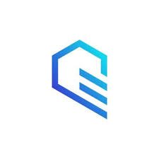

<a id="readme-top"></a>

<div align="center">

  

  # Prob Desk

  **Kalshi multi-agent trading desk** — Google **ADK** + **Gemini** with quant, risk, execution, and sentiment agents. Public market data out of the box; optional authenticated trading via the Kalshi SDK.

  <p>
    <a href="docs/adk-agents-architecture.md"><strong>Architecture</strong></a>
    &nbsp;·&nbsp;
    <a href="DESIGN.md"><strong>Design</strong></a>
    &nbsp;·&nbsp;
    <a href="ui/README.md"><strong>Web UI</strong></a>
    &nbsp;·&nbsp;
    <a href="https://google.github.io/adk-docs/"><strong>ADK docs</strong></a>
  </p>

  <p>
    <a href="https://aistudio.google.com/app/apikey">Google AI Studio key</a>
    &nbsp;·&nbsp;
    <a href="https://docs.google.com/presentation/d/e/2PACX-1vRvhUAqRBYzJmt7JCinMXmu6KVWkj-cc7ikDXGConmqjcv4mnlJacgHPcZJ20fWWnrYdubn-oczclKP/pub?start=false&amp;loop=false&amp;delayms=3000&amp;slide=id.g359756fc63c_5_25"><strong>Kalshi demo setup (slides)</strong></a>
  </p>

</div>

---

## Quick start (web UI — recommended)

**Requirements:** Python **3.10+**, Node **20+**, a [Google AI Studio API key](https://aistudio.google.com/app/apikey).

```bash
git clone https://github.com/JasonMun7/ProbDesk.git
cd ProbDesk
./scripts/setup.sh
```

Edit **`.env`** at the repo root and set `GOOGLE_API_KEY`, then:

```bash
cd ui && npm run dev
```

| Service | URL |
|---------|-----|
| **Web desk** | http://localhost:3000 |
| **Agent (AG-UI)** | http://127.0.0.1:8000 |

The setup script installs `pip install -e ".[ui]"`, copies `.env.example` → `.env` if needed, and runs `npm install` under `ui/`.

```bash
prob-desk web   # same as cd ui && npm run dev
```

<p align="right">(<a href="#readme-top">back to top</a>)</p>

---

## Web desk features

| Area | What you get |
|------|----------------|
| **CopilotKit desk** | Chat with the `trading_director` ADK agent; tool calls stream in the sidebar |
| **Generative panels** | Kalshi search, order book, portfolio, and trade receipts render in the center panel |
| **HITL trading** | `approve_kalshi_order` — Approve / Deny in chat before execution |
| **Chat welcome** | Starter suggestions and follow-ups tuned to desk workflows |
| **Thread history** | New chat, switch threads, delete — persisted in the browser |
| **Get Started** | Onboarding modal for first-time setup |
| **Settings** | Kalshi API, Google key, and AgentPhone status (reads repo-root `.env` + local desk settings) |
| **Help** | `?` in the desk header — shortcuts and demo prompts |

<p align="right">(<a href="#readme-top">back to top</a>)</p>

---

## Kalshi demo account

Public search and order books work against the **demo API** without keys. For **portfolio, orders, and live execution**, create **demo** API credentials and add them to `.env`.

| Step | Action |
|------|--------|
| 1 | Follow the **[Kalshi demo setup walkthrough (Google Slides)](https://docs.google.com/presentation/d/e/2PACX-1vRvhUAqRBYzJmt7JCinMXmu6KVWkj-cc7ikDXGConmqjcv4mnlJacgHPcZJ20fWWnrYdubn-oczclKP/pub?start=false&loop=false&delayms=3000&slide=id.g359756fc63c_5_25)** |
| 2 | Save your RSA private key as `secrets/kalshi/private_key.pem` (see [`secrets/kalshi/README.md`](secrets/kalshi/README.md)) |
| 3 | Set `KALSHI_API_KEY_ID`, `KALSHI_PRIVATE_KEY_PATH`, and keep `KALSHI_TRADE_API_BASE` on the **demo** host |
| 4 | Restart the agent (`cd ui && npm run dev`) and confirm **Settings → Kalshi API → Connected** |

<p align="right">(<a href="#readme-top">back to top</a>)</p>

---

## AgentPhone (optional)

Voice / SMS via [AgentPhone](https://agentphone.to) MCP tools on the trading director.

| Config | Where |
|--------|--------|
| `AGENTPHONE_API_KEY` | `.env` at repo root |
| Agent ID (`agt_…`) | **Settings → AgentPhone** (saved under `.prob-desk/desk-settings.json`, gitignored) |

Use the **[Kalshi demo setup slides](https://docs.google.com/presentation/d/e/2PACX-1vRvhUAqRBYzJmt7JCinMXmu6KVWkj-cc7ikDXGConmqjcv4mnlJacgHPcZJ20fWWnrYdubn-oczclKP/pub?start=false&loop=false&delayms=3000&slide=id.g359756fc63c_5_25)** for demo API keys before wiring AgentPhone flows in the desk.

<p align="right">(<a href="#readme-top">back to top</a>)</p>

---

## Environment variables

Copy **`.env.example`** → **`.env`** at the **repo root** (the Next.js app loads this file automatically).

| Variable | Required | Purpose |
|----------|----------|---------|
| `GOOGLE_API_KEY` | Yes | Gemini via ADK |
| `GOOGLE_GENAI_USE_VERTEXAI` | — | Keep `false` for AI Studio |
| `KALSHI_API_KEY_ID` | For trading / portfolio | Authenticated Kalshi SDK |
| `KALSHI_PRIVATE_KEY_PATH` | For trading / portfolio | Path to RSA PEM (see `secrets/kalshi/`) |
| `KALSHI_TRADE_API_BASE` | — | Demo vs production API host |
| `AGENTPHONE_API_KEY` | No | AgentPhone MCP |
| `AGENTPHONE_AGENT_ID` | No | Optional in `.env`; prefer Settings UI |
| `PROB_DESK_AGUI_URL` | No | Override AG-UI URL (default `http://127.0.0.1:8000/`) |

<p align="right">(<a href="#readme-top">back to top</a>)</p>

---

## Run modes

| Mode | Command | Use when |
|------|---------|----------|
| **Web desk** | `cd ui && npm run dev` or `prob-desk web` | Primary UI — chat, generative panels, trade approval |
| **AG-UI only** | `prob-desk serve` | Backend API for the UI (port 8000) |
| **Terminal REPL** | `prob-desk` | Quick prompts without the browser |
| **ADK Web** | `prob-desk adk` or `./scripts/run-adk-web.sh` | Stock Google ADK dev UI (port **8501**, not 8000) |

Do not run **ADK Web** and the **CopilotKit AG-UI** server on the same port. Default layout: AG-UI on **8000**, ADK Web on **8501**.

More UI detail: [`ui/README.md`](ui/README.md).

<p align="right">(<a href="#readme-top">back to top</a>)</p>

---

## Demo prompts (PGA example ticker)

Use market **`KXPGATOUR-PGC26-SSCH`** (Scottie Scheffler PGA) in chat:

1. **Order book** — `Show the orderbook for KXPGATOUR-PGC26-SSCH`
2. **~$1 yes buy** — ask to spend about $1 on yes, use the book for price/size, `approve_kalshi_order` in chat, then `kalshi_sdk_create_order` after approval
3. **Risk** — `For KXPGATOUR-PGC26-SSCH, check my portfolio and transfer_to_agent(agent_name='risk_manager') for a short risk summary`

Trade flow: request in chat → **Approve / Deny** in the sidebar → **executed trade receipt** in the center panel.

<p align="right">(<a href="#readme-top">back to top</a>)</p>

---

## Manual setup (without the script)

```bash
python3 -m venv .venv && source .venv/bin/activate
pip install -e ".[ui]"
cp .env.example .env
cd ui && npm install && npm run dev
```

Conda alternative: `conda env create -f environment.yml && conda activate prob-desk`.

<p align="right">(<a href="#readme-top">back to top</a>)</p>

---

## Testing

```bash
pip install -e .
pip install pytest
pytest tests/ -v
```

<p align="right">(<a href="#readme-top">back to top</a>)</p>

---

## Project layout

```
ProbDesk/
├── prob_desk/          # ADK agents, Kalshi tools, AG-UI server
├── ui/                 # Next.js + CopilotKit web desk
├── docs/readme-logo.png # README header logo
├── ui/public/brand/    # Web UI logo assets
├── scripts/setup.sh    # One-shot local setup
├── .env.example
└── DESIGN.md
```

| Topic | Doc |
|--------|-----|
| Agent graph & tools | [`docs/adk-agents-architecture.md`](docs/adk-agents-architecture.md) |
| Execution RL scripts | [`docs/tactical-policy-cli-scripts.md`](docs/tactical-policy-cli-scripts.md) |

<p align="right">(<a href="#readme-top">back to top</a>)</p>

---

## License

MIT — see [`pyproject.toml`](pyproject.toml).
