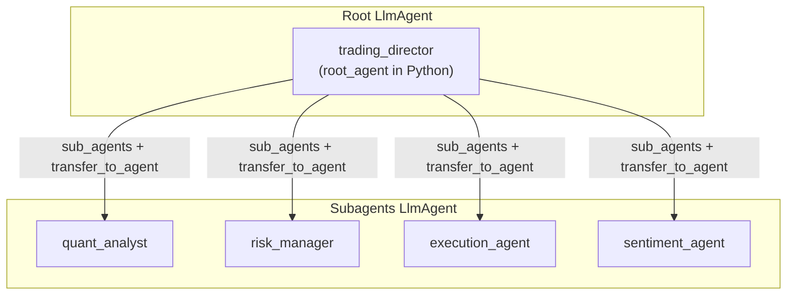

# Prob Desk — ADK agents

**Contributor note:** Any change to **Google ADK** (`google-adk`), `LlmAgent`, `Runner`, sessions, **tools**, `transfer_to_agent`, or multi-agent wiring must follow [`.cursor/rules/adk-development.mdc`](../.cursor/rules/adk-development.mdc): use the **ADK documentation MCP** (`list_doc_sources` → `fetch_docs`) and installed ADK skills under `~/.agents/skills/` as needed; resolve conflicts in favor of fetched docs.

---

**Prob Desk** is a multi-agent Kalshi research stack built with **Google ADK** (`LlmAgent` + LLM-driven delegation). This document describes the agent graph.

## Naming: `root_agent` vs `trading_director`

| What | Meaning |
|------|---------|
| **`root_agent`** | Python variable in [`prob_desk/agents/root_agent.py`](../prob_desk/agents/root_agent.py) — this is what you pass to **`Runner(agent=...)`**. One name for the graph entrypoint in code. |
| **`trading_director`** | **`LlmAgent.name`** inside ADK — used for logs, UI, and **`transfer_to_agent(agent_name='quant_analyst')`**, etc. |
| [`prob_desk/agents/prompts.py`](../prob_desk/agents/prompts.py) | Director + subagent prompt strings, **`GLOBAL_INSTRUCTION`**, **`DELEGATION_MARKDOWN`**, templates. |
| [`prob_desk/agents/tools/__init__.py`](../prob_desk/agents/tools/__init__.py) | **`KALSHI_PUBLIC_TOOLS`**, **`KALSHI_TOOLS_READ`** (director/quant/risk), **`KALSHI_TOOLS`** (+ order writes for execution), **`kalshi_get_live_quote`**, **`TACTICAL_POLICY_TOOLS`** |
| [`prob_desk/agents/tools/agentphone_mcp.py`](../prob_desk/agents/tools/agentphone_mcp.py) | Optional **`get_agentphone_toolset()`** → AgentPhone **`McpToolset`** (Streamable HTTP) when **`AGENTPHONE_API_KEY`** is set |
| [`prob_desk/agents/adk_app.py`](../prob_desk/agents/adk_app.py) | ADK **`App`** with **`ReflectAndRetryToolPlugin`** (Kalshi transient errors) — use for **`Runner`** and **`adk web`** via **`app`** export |
| [`prob_desk/agents/tools/tactical_policy.py`](../prob_desk/agents/tools/tactical_policy.py) | **`suggest_execution_plan`** — greedy rollout of trained `models/tactical_policy.pt` |
| [`prob_desk/execution/`](../prob_desk/execution/) | `prob_desk.execution` — sim env, baselines, metrics (not ADK agents) |

There is no separate `trading_director.py` module: the director **is** `root_agent` in `root_agent.py`.

## Architecture diagram



## Package layout (agents)

| Path | Role |
|------|------|
| [`root_agent.py`](../prob_desk/agents/root_agent.py) | Defines **`root_agent`** (`name="trading_director"`) and re-exports subagents + runtime constants |
| [`prompts.py`](../prob_desk/agents/prompts.py) | All prompt strings (director, subagents, `GLOBAL_INSTRUCTION`, `DELEGATION_MARKDOWN`, templates) |
| [`runtime_settings.py`](../prob_desk/agents/runtime_settings.py) | `GEMINI_MODEL`, `APP_NAME`, `DEFAULT_USER_ID`, `SYSTEM_CONTEXT_SUFFIX` |
| [`tools/`](../prob_desk/agents/tools/) | `kalshi_api.py` (public HTTP), `kalshi_sdk_client.py` + `kalshi_sdk_tools.py` (official SDK), `tactical_policy.py` + exports in `__init__.py` |
| [`subagents/`](../prob_desk/agents/subagents/) | Leaf `LlmAgent`s: quant, risk, execution, sentiment |

## Agent types

| ADK category | Used in Prob Desk |
|--------------|-------------------|
| `LlmAgent` | Yes — root and all subagents |
| `SequentialAgent` / `ParallelAgent` / `LoopAgent` | No — routing is LLM-driven (`transfer_to_agent`), not a fixed workflow |
| Custom `BaseAgent` | No — market data via Python function tools |

## Hierarchy

- **Root:** `trading_director` (exported as `root_agent` from `prob_desk.agents`).
- **Subagents** (leaves): `quant_analyst`, `risk_manager`, `execution_agent`, `sentiment_agent`.

## Roles and tools

| `name` | Role | Kalshi tools |
|--------|------|----------------|
| `trading_director` | Orchestrate analysis; delegate via `transfer_to_agent` | Public HTTP + SDK + optional **AgentPhone MCP** (calls/SMS). No **`google_search`** here—Gemini disallows mixing it with function tools; delegate to **`sentiment_agent`** for news. |
| `quant_analyst` | Quant / probability analysis with market data | Public HTTP + SDK + **`kalshi_get_live_quote`** |
| `risk_manager` | Sizing, drawdown, resolution / liquidity risk | Public HTTP + SDK portfolio reads (`kalshi_sdk_get_balance`, positions, orders) |
| `execution_agent` | Order-style parameters; **RL tactical plan** + Kalshi grounding + **orders** | **`KALSHI_TOOLS`** + policy tools (includes live quote) |
| `sentiment_agent` | News / narrative sentiment | ADK **`google_search`** (Gemini grounding; uses **`GOOGLE_API_KEY`**) |

## Runner plugins (reflect and retry)

[`prob_desk/agents/runner_plugins.py`](../prob_desk/agents/runner_plugins.py) registers **`ProbDeskReflectAndRetryPlugin`** (`ReflectAndRetryToolPlugin`, `max_retries=3`). It retries tool failures when Kalshi tools return JSON **`error`** payloads (timeouts, 5xx) or raise exceptions. Wired via [`prob_desk/agents/adk_app.py`](../prob_desk/agents/adk_app.py) → **`prob_desk.agents.app`**; [`prob_desk/main.py`](../prob_desk/main.py) uses **`Runner(app=...)`**. For **`adk web`**, ensure the loader resolves **`app`** (exported from [`prob_desk/agents/__init__.py`](../prob_desk/agents/__init__.py)).

## Live quotes (`kalshi_get_live_quote`)

[`prob_desk/agents/tools/kalshi_stream.py`](../prob_desk/agents/tools/kalshi_stream.py): short WebSocket **`ticker`** subscription (2.5s cap) when Kalshi API keys are set; otherwise REST **`kalshi_get_orderbook`** top-of-book. WebSocket host tracks **`KALSHI_TRADE_API_BASE`** (demo → `external-api-ws.demo.kalshi.co`).

## TargetIntent JSON (for `suggest_execution_plan`)

The execution agent passes a **JSON string** to `suggest_execution_plan`. Valid keys (Pydantic: [`TargetIntent`](../prob_desk/execution/schemas.py)):

```json
{
  "market_ticker": "KXHIGHNY-25JAN01-T65",
  "side": "yes",
  "target_net_contracts": 10,
  "horizon_steps": 40,
  "risk_budget_cents": 50.0,
  "regime_tag": "wide_spread"
}
```

- **`side`**: `yes` means the signed `target_net_contracts` applies to the YES contract; `no` flips sign internally in the simulator.
- If weights are missing at `models/tactical_policy.pt` (or `TACTICAL_POLICY_PATH`), the tool returns `ok: false` — explain and fall back to Kalshi tools + heuristics.

Course proposal alignment (venue + eval scope): [`docs/execution/PROJECT_PROPOSAL.md`](execution/PROJECT_PROPOSAL.md).

## Session / app id

- `APP_NAME` = `prob_desk` (Runner, `InMemorySessionService`).

## Google GenAI

Default setup uses **Google AI Studio** (`GOOGLE_API_KEY`). Set `GOOGLE_GENAI_USE_VERTEXAI=false` so the client does not assume Vertex AI.

## Kalshi: demo-first and credentials

- Default Trade API base in `.env.example` is the **demo** host. **Authenticated** calls use the official **`kalshi-python-sync`** client (`KalshiClient` + RSA key); set `KALSHI_API_KEY_ID` and `KALSHI_PRIVATE_KEY_PATH` (or `KALSHI_PRIVATE_KEY_PEM`) for portfolio and order tools. Without credentials, SDK tools return a JSON error hint; **public** HTTP tools still work for market data.

## AgentPhone MCP (optional)

- Set **`AGENTPHONE_API_KEY`** in `.env` (see [agentphone.to](https://agentphone.to); key format `sk_live_...`). Loaded via [`prob_desk/env_loader.py`](../prob_desk/env_loader.py) on package import.
- [`get_agentphone_toolset()`](../prob_desk/agents/tools/agentphone_mcp.py) returns **`None`** when the key is missing so **`from prob_desk.agents import root_agent`** and **`adk web`** work without AgentPhone.
- When configured, only **`trading_director`** gets the toolset: **Streamable HTTP** to `https://mcp.agentphone.to/mcp` with `Authorization: Bearer <key>` (30s connect timeout). Alternative: stdio `npx -y agentphone-mcp` with the same env var (not used by default).
- Prompts require **explicit user consent** before placing calls or sending SMS; subagents do not receive AgentPhone tools.
